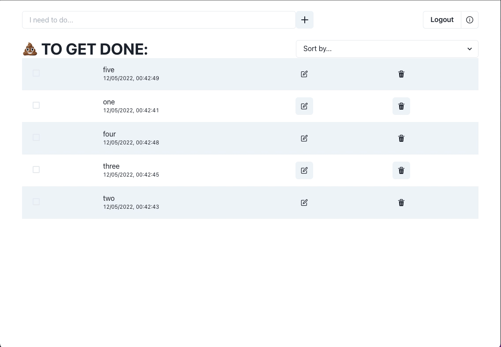

<!-- Please update value in the {}  -->

<h1 align="center">✍️ToDo App</h1>

  <h3>
    <a href="https://heytheretodo.netlify.app/">
      Demo
    </a>
  </h3>

<!-- OVERVIEW -->

## Overview

A "serverless" CRUD app:

- User can register, login, logout
- User can _create_ to-do
- User can _read_ the to-dos
- User can _update_ to-do and check/uncheck
- User can _delete_ to-do
- User can see filter/sort the to-dos
- __Email authentication is turned off, but if you still prefer NOT to create a new user account, you can use this:__
    - email: tester@example.com
    - password: 123456

### Built With

- [React](https://reactjs.org/)
- [Chakra UI](https://chakra-ui.com/)
- [Firebase](https://firebase.google.com/)

## Contact

<!-- - Website [your-website.com](https://{your-web-site-link}) -->
- GitHub [@heyitsashleyhere](https://github.com/heyitsashleyhere)
- Twitter [@ashhhleyhere](https://twitter.com/ashhhleyhere)